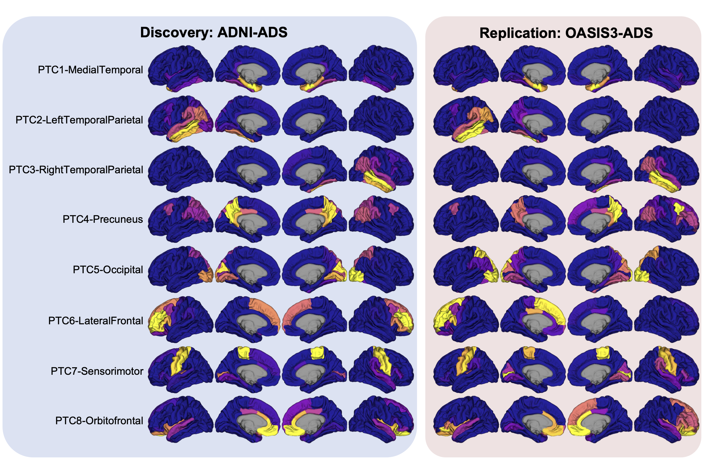

# Learning flortaucipir patterns with NMF

This repository contains public code for Tom's project (applying non-negative matrix factorization to flortaucipir images).

## Setup

0. Make sure you have installed the [required software](#requirements).
1. Download this repository (either with git or GitHub).
2. [Download and supply the necessary data from ADNI & OASIS3](#downloading-raw-data)
3. Start a new terminal in your copy of the download repository.

## Usage

Once you have completed the [setup](#setup) steps, you can try using some of the provided shell scripts to reproduce analyses & figures locally.

#### Create main analysis tables (run_build_datasets.sh)

`run_build_datasets.sh` creates several tables in the `derivatives` folder for both the ADNI & OASIS3 datasets.  This must be run before creating any figures.

#### Create figures (run_all_figures.sh)

`run_all_figures.sh` will iteratively run the plot creation scripts in each figure folder (`figure/fig#`).  You can alternatively run any individual figure by entering a figure folder and running the script `run.sh`.  Each script creates tables and graphs within their respective folder.  All figures can only be run after the outputs created by `run_build_datasets.sh` have been generated.  Several figures can only be run after previous figures have been run (e.g., the longitudinal staging in Figure 4 can only be created after the cross-sectional staging in Figure 2).

Note that the gene expression correlation results (Figure 6) take a relatively long time to run (several minutes to download the gene expression, and another several minutes to run the correlations).

#### Rerunning NMF

[See the NMF folder README](https://github.com/sotiraslab/nmf_tau/tree/main/nmf).

## Requirements

This project used the following languages:

- Python (3.8.3)
- R (4.2.0)
- MATLAB (2022b)

The [requirements](https://github.com/sotiraslab/nmf_tau/tree/main/figures) folder documents specific required packages and helper scripts for installing them.  Specifically, use `install_requirements.sh` to install all necessary R & Python packages (these are documented in `requirements_r.txt` and `requirements_python.txt`, respectively).

MATLAB scripts do not require any specific packages/add-ons.  All necessary MATLAB code files should be included in this repository.

BASH scripts are also used for stitching together other scripts.

## Downloading raw data

This repository does not include data from ADNI/OASIS which require approval to access.  This section will document the instructions for accessing the data necessary for this project.

**All files described here (for both ADNI & OASIS) should be placed in the `rawdata` folder.**   Note that some files will need to be renamed.

### ADNI

#### ADNIMERGE R package

- https://ida.loni.usc.edu/ > ADNI > Download > Study Data > Study Info > Data & Database > ADNIMERGE - Key ADNI tables merged into one table - Packages for R [ADNI1,GO,2]
- Follow instructions for installation here: https://adni.bitbucket.io/
- Data for this project were download on November 23, 2022

#### PTDEMOG.csv

- https://ida.loni.usc.edu/ > ADNI > Download > Study Data > Subject Characteristics > Subject Demographics > Subject Demographics [ADNI1,GO,2,3]
- This file was specifically downloaded to find some demographic information missing from ADNIMERGE R.

### OASIS-3

#### Amyloid PUP results

- https://central.xnat.org/ > Browse > My Projects > OASIS3 > Add Tab > PUPs > Options > Edit Columns > Add column "PET_fSUVR_rsf_TOT_CORTMEAN" > Options > Spreadsheet
- **RENAME THIS FILE:** `oasis_amyloid.csv`

#### Flortaucipir PUP results

- https://central.xnat.org/ > Browse > My Projects > OASIS3_AV1451 > Add Tab > PUPs > Options > Edit Columns > Add all columns containing "fSUVR" (the ones containing "rsf" are not needed, but can be included) > Options > Spreadsheet

- **RENAME THIS FILE:** `oasis_flortaucipir.csv`

#### FreeSurfer results

- https://central.xnat.org/ > Browse > My Projects > OASIS3 > Add Tab > FreeSurfers > Options > Edit Columns > Add all columns matching `"lh_..._volume"` or  `"rh_..._volume"`> Options > Spreadsheet

- **RENAME THIS FILE:** `oasis_freesurfer.csv`

#### OASIS3 Data Files

  - https://central.xnat.org/ > Browse > My Projects > OASIS3 > On the "Subjects" tab, click "0AS_data_files" > Click "MR Session" next to "OASIS3_data_files" > Select all entries ("demo through DUT") > Bulk Actions: Download.
  - Unzip the downloaded folder, and place it in the `rawdata` folder.  This folder should be called "OASIS3_data_files" (it should not have to be renamed).

## Troubleshooting

Please log any issues for trouble running or reproducing analyses.  Before doing so, note:

- Make sure you have the required software and packages installed and available.
- Make sure you have added the required data from ADNI & OASIS3
- Some (hopefully small) deviation in results is expected.  This could be because:
  - There is a random process that is not seeded.  I tried to have most random functions seeded, but I may have missed something.
  - *The data provided by ADNI or OASIS have been updated*.  This should not be an issue for OASIS-3 which has a stable release, but may be an issue for the ADNI.  The ADNIMERGE R package is not meaningfully versioned, and can only be compared based on the date of download (the version I originally used is from November, 2022).  I have included a list of the subjects I used in the `subject_lists` folder, which is used to filter the subjects going into the main subject tables being created.   However, this will not account for other assessments which are linked to these subjects (e.g., CDR scores, amyloid imaging, etc.)
